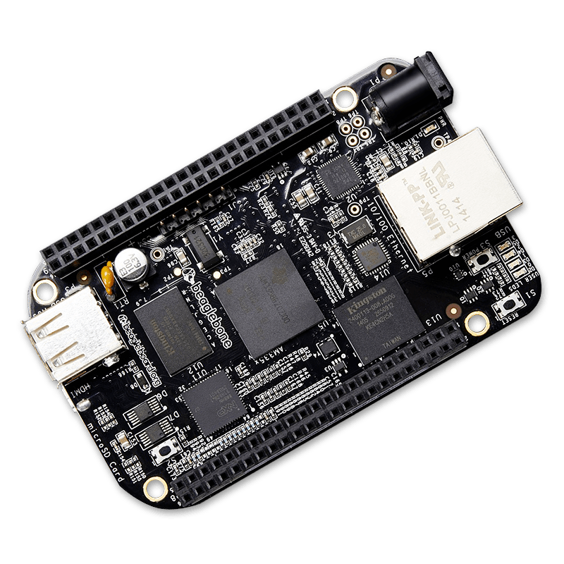

# Técnicas de Programação para Sistemas Embarcados I e II

Este repositório guarda as práticas e atividades das disciplinas TPSE I e TPSE II, ambas ministradas pelo professor Francisco Helder, no curso de Engenharia de Computação da [UFC Campus Quixadá](https://www.quixada.ufc.br/).

## Objetivo das disciplinas

Ambas têm como objetivo introduzir e aprimorar as habilidades de programação em Sistemas Embarcados, bem como explicando o funcionamento de clock, timers, interrupções, como a interpretação de manuais, datasheets e esquemáticos. Em ambas as disciplinas, foi utilizada como base para as atividades, práticas e projetos a placa [BeagleBlone Black](https://beagleboard.org/black).



## Diretórios

Os diretórios estão organizados da seguinte forma:

```
docs/                     # Documentos da beaglebone
│   ├── am335x_datasheet  # Datasheet do processador
│   ├── am335x_manual     # Manual do processador
│   └── beaglebone_sc...  # Esquemático da BeagleBone Black
resources/                # Recursos do repositório
│   ├── gpio_int          # Template para interrupção com gpio
│   ├── timer_int         # Template para interrupção com timer
│   └── base.png          # Imagem da BeagleBone Black
tpse_I/                   # Arquivos referentes a TPSE I
├── ap01/                 # Questões da avaliação parcial 1
├── atividades/           # Atividades teóricas
└── lab/                  # Práticas em laboratório
README.md                 # Documentação do projeto (você está aqui)
```

## Projetos adjacentes

[bbb_genius](https://github.com/ryanguilherme/bbb_genius) - minijogo Genius programado na BeagleBone Black como projeto final de TPSE I


## Aluno

- [Ryan Guilherme](https://github.com/ryanguilherme)

## Compilação e Execução

O projeto é gerenciado por um `Makefile`. Para compilar e executar as práticas de laboratório, siga as etapas abaixo:

1. Certifique-se de ter as dependências de desenvolvimento instaladas no seu sistema e na BeagleBone Black.
2. Clone este repositório em seu dispositivo.
3. Acesse o diretório da prática desejada.
4. Execute o comando `make` para compilar o projeto.
6. Com o tftp devidamente configurado para o diretório /tftpboot/, o binário (nomeDoBinário.bin) será armazenado nele.
7. No endereço de memória desejado da BeagleBone Black, acesse o arquivo binário e a aplicação iniciará.
